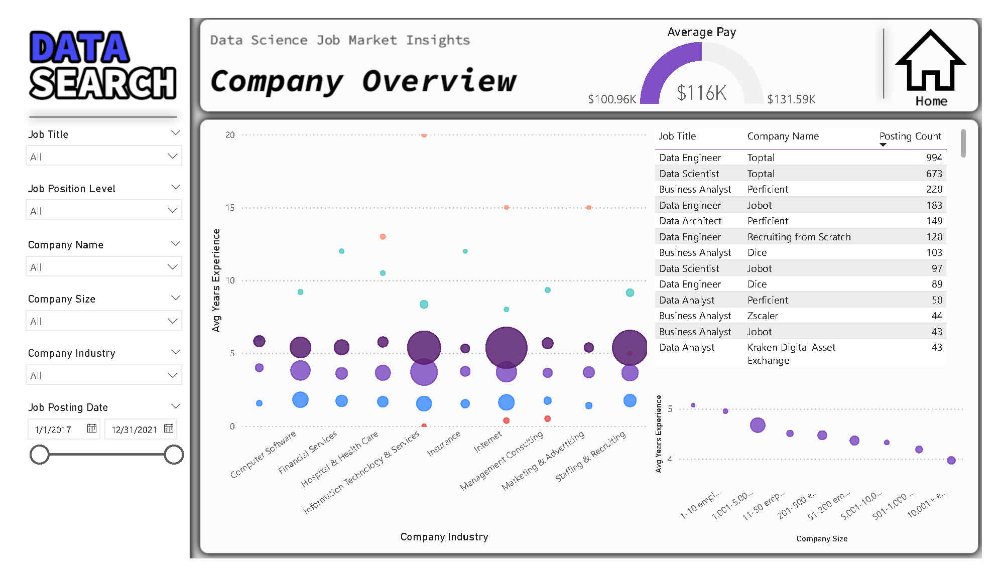

# Data Science Job Market Analysis in Power BI

## Introduction

DataSearch, an employee recruiting firm, aimed to uncover trends within the data science industry. The goal was to gain insights into the demand for specific job roles and skills and identify key trends in the job market. This analysis was performed using Power BI on a fictitious dataset containing key details from job postings from 2017 to 2021.

## Data Characteristics

- The dataset includes details from job postings in the data science industry.
- Each row represents a specific job posting at a given time.
- The data is structured as a single table with 19 columns, capturing various aspects of each job posting.

## Exploratory Data Analysis (EDA)

### Available Jobs Overview

1. **Increasing Job Postings:** The analysis revealed a steady increase in the number of job postings over the years, indicating a growing job market in the data science industry.
2. **In-Demand Roles:** Data Engineers, Data Scientists, and Analysts were the most sought-after positions, highlighting the industry's demand for these skills.
3. **Tech Industry Dominance:** The technology sector was the primary driver of job openings in the data science field, emphasizing its importance in this domain.
4. **Rising Salaries:** Salaries for data science roles showed a positive trend, aligning with industry expectations and making it an attractive career path.

### Job Skills Overview

This section explores the correlation between specific skills and job titles, identifying the key skills employers demand for various data science roles.

### Company Overview

This part examines the top industries and companies actively hiring for data science positions, providing valuable insights into potential employment opportunities for job seekers.

## Key Findings

1. **Skill and Job Title Correlation:** The analysis revealed strong correlations between specific skills and job titles, enabling job seekers to tailor their skills to meet the requirements of their desired roles.
2. **Top Industries and Companies:** The top industries and companies with the highest demand for data science professionals were identified, helping job seekers focus their job search efforts.
3. **Recommendations:** The report concludes with potential recommendations for job seekers, employers, and educational institutions to navigate the evolving data science job market.

## Conclusion

This analysis, conducted in Power BI, has provided valuable insights for DataSearch and the broader data science community. Understanding job trends and skill requirements allows individuals and organizations to make informed decisions to succeed in the dynamic field of data science.

For a more detailed analysis and interactive visualizations, please refer to the Power BI report associated with this case study.

